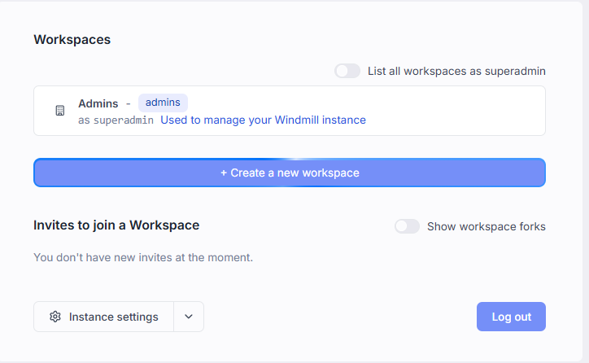
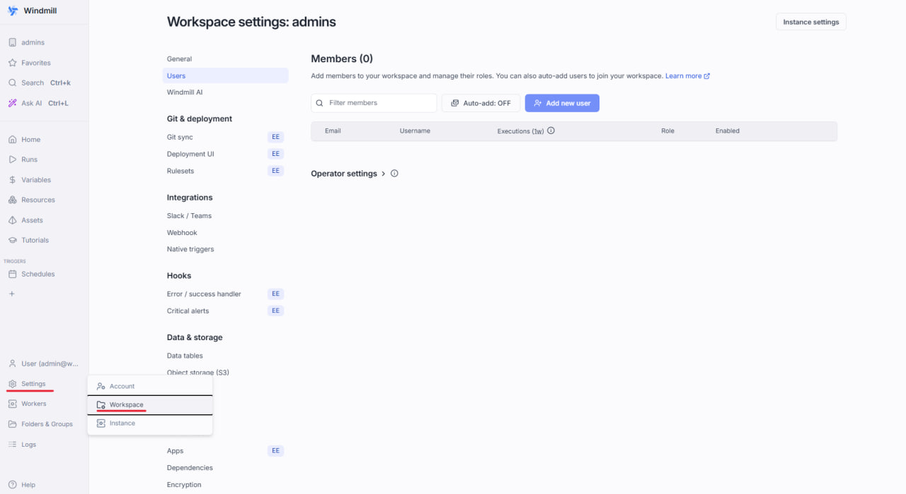
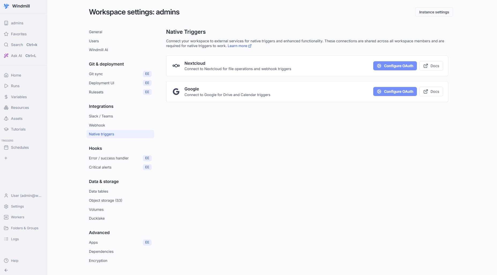
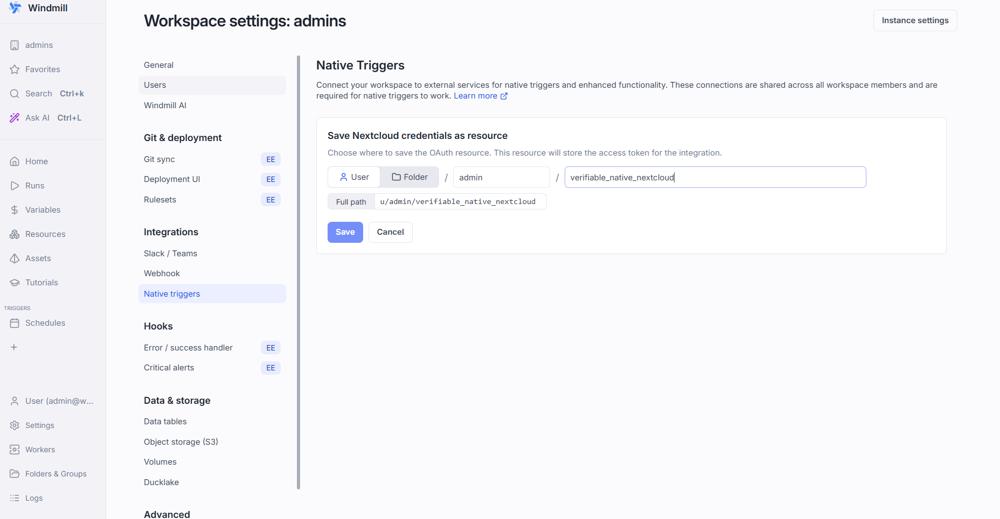
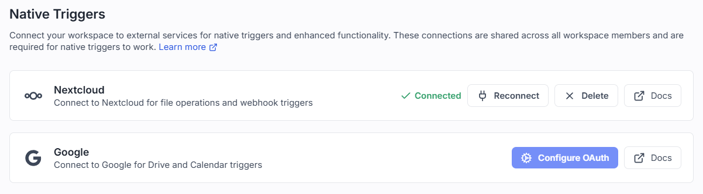
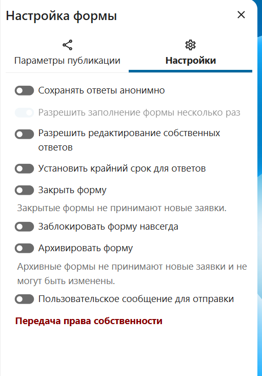

# mse1h2026-table

## Требования

Перед началом убедитесь, что установлены:

- [Docker](https://docs.docker.com/get-started/get-docker/) и [Docker Compose](https://docs.docker.com/compose/install/)
- Python 3.x
- Git

---

## Необходимые настройки

Добавьте запись в файл `/etc/hosts` (требуется один раз):
```
127.0.0.1   nextcloud.local
```

На Linux/macOS это можно сделать командой:
```bash
echo "127.0.0.1   nextcloud.local" | sudo tee -a /etc/hosts
```

---
## Установка и запуск

1. Склонируйте репозиторий и перейдите в него:
 
```bash
git clone https://github.com/moevm/mse1h2026-table.git
cd mse1h2026-table
```
 
2. Перейдите в папку `table/` — все дальнейшие команды `manage.py` выполняются отсюда:
 
```bash
cd table
```

3. Запустить систему:
```bash
   python manage.py deploy up
```
   Или напрямую через Docker Compose (из папки `deploy/`):
```bash
   cd deploy
   docker compose up -d
```

4. После запуска Nextcloud (с подключённым OnlyOffice) доступен по адресу:
   **http://nextcloud.local:8080**

   При необходимости порт можно изменить через переменную `NEXTCLOUD_PORT` в файле `deploy/.env`.

5. Дождаться полной готовности системы:
```bash
python manage.py deploy status --wait
```

6. Наполнить систему тестовыми данными:
```bash
   python manage.py deploy demo
```

7. Для остановки:
```bash
python manage.py deploy down
```

Или напрямую через Docker Compose (из папки `deploy/`):
```bash
cd deploy
docker compose down
```

#### Интеграция Nextcloud Forms -> Windmill

После запуска стека в `deploy/docker-compose.yml` автоматически поднимаются сервисы:

- `windmill-db` (PostgreSQL для Windmill)
- `windmill` (Windmill server)
- `windmill-worker` (исполнитель workflow)

Далее настройка OAuth-подключения в Windmill:

1. Откройте в браузере Windmill, доступный по адресу: http://windmill.local:8000
2. Войдите в workspace admin. 



3. Перейдите `Settings -> Workspace -> Native Triggers`.




4. Для интеграции Nextcloud укажите `Nextcloud base URL`. (http://nextcloud.local:8080).
5. Для получения `Client ID` и `Client secret` выполните скрипт из папки `deploy`:
   ```
   ./create_windmill_oauth.sh
   ```
6. Нажмите `Connect`.
7. Подтвердите доступ учетной записью Nextcloud и дождитесь возврата в Windmill.
8. В всплывающем окне нажмите `Configure your instance settings to get started` нажмите `Skip`.
9. В окне `Save Nextcloud credentials as resource` нажмите `Save`.



10. Убедитесь, что в интерфейсе Windmill статус подключения стал `Connected`.



### Создание Windmill workflow:

1. Настройте OAuth подключение по инструкции выше.
2. На главной странице рядом с кнопкой "+flow" выберите "Import from YAML".
3. Вставьте содержимое файла windmill_workflow.yaml.
4. В блок Triggers необходимо добавить NextCloud.
5. Нажмите Deploy.
6. Проверьте ещё раз, что Trigger содержит NextCloud

Теперь в панели Runs будут отображаться получаемые запросы, при отправке формы в NextCloud

### Создание и отправка формы

После настройки Windmill, данные из формы попадают в систему следующим образом:
1. В разделе "Формы" Nextcloud создайте новую или выберите существующую форму и добавьте в нее необходимые вопросы.
2. Во вкладке `Поделиться` можно настроить саму форму, а также сгенерировать ссылку для общего доступа.

3. Во вкладке `Результаты` формы нажмите `Создать электронную таблицу`, чтобы связать форму с хранилищем данных.
4. При отправке ответа в Nextcloud Forms генерируется событие, которое перехватывается Windmill через триггер, настроенный в пункте `Создание Windmill workflow`.

#### Проверка, что интеграция реально работает

1. Проверить статус подключения в Windmill:
   - `Settings -> Workspace -> Native Triggers -> Nextcloud`
   - Статус должен быть `Connected`.
2. Создать тестовый flow:
   - `New Flow` -> блок `Triggers` -> `+` -> `Nextcloud`.
   - В списке событий должны быть доступны события (без ошибок `No events available`).
3. Выполнить тест события:
   - Отправить тестовый ответ в Nextcloud Forms.
   - Убедиться, что в Windmill у flow появился новый `Run`.
4. Если у flow нет запусков:
   - проверить логи Windmill: `docker logs --tail 200 windmill-server`
   - проверить, что нет ошибок `Failed to exchange code for token`.

---

## Работа с пользователями Nextcloud через manage.py
Все команды выполняются из папки `table/`:
```bash
cd table
```

### Просмотр пользователей

- Показать всех пользователей (только логины):
  ```bash
  python manage.py users list
  ```

- Показать всех пользователей с подробностями (email, группы, квота):
  ```
  python manage.py users list --details
  ```

#### Фильтрация пользователей

Для гибкой фильтрации используйте флаг --filter <поле> <режим> <значение>. Можно указывать несколько фильтров подряд.

- По username (начинается с 'adm'):
  ```
  python manage.py users list --filter username prefix adm
  ```
- По email (содержит 'example.com'):
  ```
  python manage.py users list --filter email contains example.com --details
  ```
- По группе (точное совпадение 'admin'):
  ```
  python manage.py users list --filter group exact admin --details
  ```
- Комбинированные фильтры:
  ```
  python manage.py users list --filter username prefix adm --filter email contains mail.ru --details
  ```

#### Описание фильтров
- <поле>: username, email, group
- <режим>: contains (содержит), prefix (начинается с), exact (точное совпадение)
- <значение>: строка для поиска

- Для просмотра email, групп и квоты используйте флаг --details.
- Флаг --prefix также работает для фильтрации по началу username.

### Создание и удаление пользователей

- Создать одного пользователя:
```bash
  python manage.py users create <username> --email <email> --display-name <name> --user-password <password> --quota 1GB --groups <group>
```
- Удалить одного пользователя:
```bash
  python manage.py users delete <username>
```
- Создать пользователей из CSV:
```bash
  python manage.py users csv-create <path/to/file.csv>
```
- Удалить пользователей из CSV:
```bash
  python manage.py users csv-delete <path/to/file.csv>
```

### Загрузка таблиц

- Загрузить один файл:
```bash
  python manage.py upload --file <path/to/file.xlsx> --dest /папка --name "Название"
```
- Загрузить все файлы из директории:
```bash
  python manage.py upload --dir <path/to/dir> --dest /папка
```

### Мониторинг и статус

- Проверить статус всех компонентов системы:
```bash
  python manage.py deploy status
```
- Ждать полной готовности системы:
```bash
  python manage.py deploy status --wait
```
- Посмотреть метрики ресурсов (CPU, RAM, диск):
```bash
  python manage.py monitor resources
